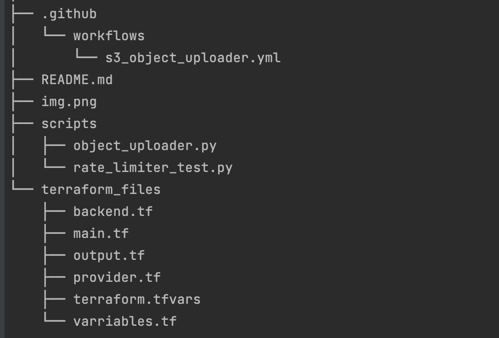

# Yahoo_Assessment
This repository contains a combination of terraform code to create the required infrastructure and some python scripts to automate and execute the task requirements of this take home assessment.

Find below the directory tree of this repository:



## Description of Repo Folders/Structure
Terraform_Files Directory: contains the terraform files required to provision the infrastructure for this assessment.
* backend.tf: backend configuration to store the statefile safely within an s3 bucket and access it remotely.
* main.tf: main blocks of code to provision the required resources
* output.tf: configured to output the s3 bucket name and kms key id which are required as inputs to the python script.
* provider.tf: used to configure the aws provider pluggin to enable rpc to the aws cloud account.
* terraform.tfvars: used to provide the values to the variables defined in the variables.tf file
* variables.tf: used to define variables used to pass values from outside the configuration

Scripts: Contains python scripts used to upload the the object uploads into the s3 bucket.
* object_uploader.py: python script with the main automation required for this assessment. It automates the process of uploading a time stamped object to an s3 bucket.
* http_endpoint.py: python script to create an http endpoint using the flask module, shows the most recent upload to the s3 bucket and limits the rates for 210 requests per ip every 10 minutes.
* rate_limiter_test.py: a simple python script used to test the configuration for the rate limiter configured.

.github: this directory is used to configure a github actions worflow to further automate the process.
* s3_object_uploader: workflow to run the python automation every 10 minutes.


## Deployment Instructions
### Local Deployment
* In this approach the repository is cloned to a local machine and all the required commands to provision the infrastructure and run the scripts are executed locally.
* Clone the repo: 
  * ```git clone <repo>```
* configure access to AWS via cli
  * ```aws configure #follow command prompts```
* navigate into the terraform files directory and run the standard terraform commands
  * ```cd terraform_files```
  * ```terraform init```
  * ```terraform plan```
  * ```terraform apply```
* Test the object upload script by navigating to the scripts directory and executing the object_uploader.py python file
  * ```cd scripts```
  * ```python3 object_uploader.py```
* Execute the http_endpoint script to create an endpoint 
  * ```python3 http_enpoint.py```
* Open a new terminal window and execute the rate_limiter_test script to simulate requests beyond the limit to validate that the limiter works correctly.
* Create a cronjob to execute the object_uploader python script every 10 minutes.
  * ```crontab -e```
  * ```*/10 * * * * /path to file/object_uploader.py```

### Pipeline Deployment
* A pipeline can be created to automate the provisiong on required aws infrastructure.
  * n.b: this github actions pipeline has been configured and can be found in the repo .github/Workflows/aws_infra_provisioning.yml
* An alternative to automate the s3 object upload process would be to create a pipeline with github actions to deploy the object_uploader.py script scheduled to trigger every 10 minutes.
  * n.b: this github actions pipeline has been configured and can be found in the repo .github/Workflows/s3_object_uploader.yml
* clone the repo to a local machine
  * ```git clone <repo>```
* * Execute the http_endpoint script to create an endpoint 
  * ```python3 http_enpoint.py```
  * N.B: You can access the endpoint by using the urls from the output of script in a browser or running a curl command against it (example below) on the machine flask is running.
    * ```curl 127.0.0.1:5000```
* Open a new terminal window and execute the rate_limiter_test script to simulate requests beyond the limit to validate that the limiter works correctly.
  * ```python3 rate_limiter_test.py```
* Create a cronjob to execute the object_uploader python script every 10 minutes.
  * ```crontab -e```
  * ```*/10 * * * * /path to file/object_uploader.py```

## Tear-down Instructions
### Local Deployment
* Disable the cronjob by removing the crontab entry for that job
* cd into the terraform_files directory and run a terraform destroy
  * ```cd terraform_files```
  * ```terraform destroy```

### Pipeline Deployment
* Disable the github actions workflow
  * ```github repo -> actions -> s3_object_uploader -> ellipsis icon -> disable workflow```
  * ```github repo -> actions -> aws_infra_provisioning -> ellipsis icon -> disable workflow```
* cd into the terraform_files directory and run a terraform destroy
  * ```cd terraform_files```
  * ```terraform destroy```